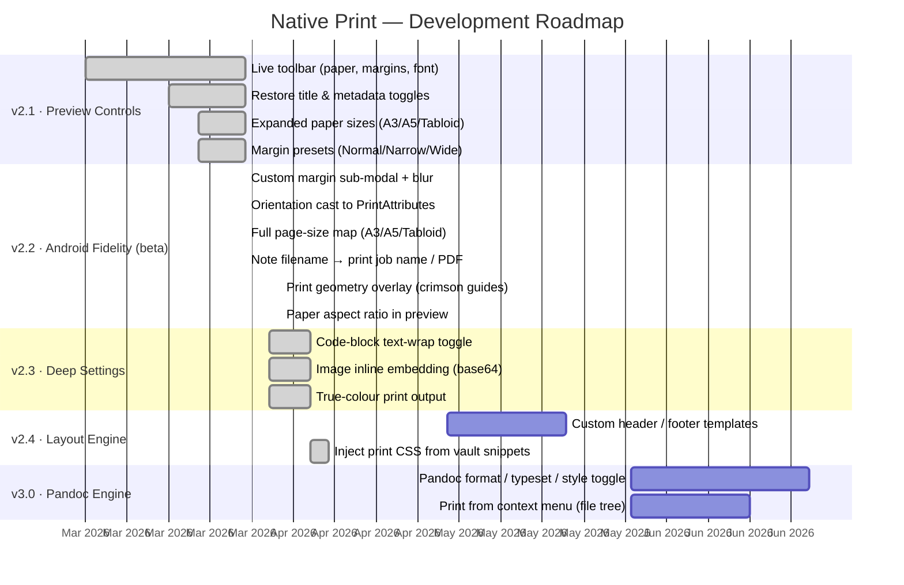

# Native Print

An [Obsidian](https://obsidian.md) plugin that prints the current note on desktop via the browser print dialog, and on Android via the [Obsidian Print Helper](https://github.com/PWereh/native-print-helper) companion APK.

No file permissions required on Android (API 33+). HTML is passed inline via a custom URL scheme — no `READ_EXTERNAL_STORAGE` or scoped-storage handling needed.

---

## Features

- **Desktop** — triggers `window.print()` directly
- **Android** — renders the note to HTML and launches the Print Helper APK via a custom scheme URL
- Live print preview with inline toolbar (paper size, orientation, margins, font, title, metadata toggles)
- **Print geometry overlay** — dashed crimson page boundary and margin guides overlaid on the preview; live on custom margin edits, snapshot on preset changes
- Scaled paper shape — preview iframe matches the selected paper's aspect ratio (A3/A4/A5/Letter/Legal/Tabloid, portrait and landscape)
- Page sizes: A3, A4, A5, Letter, Legal, Tabloid
- Margin presets (Normal / Narrow / Wide) plus custom sub-modal with live mm steppers
- Optional document title heading and YAML frontmatter in output
- Ribbon icon + command palette entry + context menu

---

## Roadmap



### Backlog detail

| Area | Item | Priority | Status |
|---|---|---|---|
| Android | Custom margin sub-modal with blur | High | ✅ 2.2.0 |
| Android | Orientation → `PrintAttributes` | High | ✅ 2.2.0 |
| Android | Full page-size map (A3/A5/Tabloid) | High | ✅ 2.2.0 |
| Android | Note filename as print job/PDF name | High | ✅ 2.2.0 |
| Preview | Page-break algorithm (content in margins) | High | 🐛 #preview-pagebreak-001 |
| Preview | Mermaid diagrams print as code blocks | High | 🐛 #mermaid-codeblock-001 |
| Preview | Code-block text-wrap toggle | High | ✅ 2.3.0 |
| Preview | Image inline embedding (base64) | High | ✅ 2.3.0 |
| Preview | True-colour print output | Medium | ✅ 2.3.0 |

| Layout | Custom header/footer per-template | Medium | Planned |
| Layout | Print CSS from vault snippets (.obsidian/snippets) | Medium | ✅ 2.4.0 |
| Engine | Pandoc integration (format/typeset) | Low | Planned |
| UX | Print from file-explorer context menu | Medium | Planned |

---

## Installation

### From Obsidian Community Plugins *(pending)*

Search for **Native Print** in Settings → Community Plugins.

### Manual

1. Download `main.js`, `manifest.json`, and `styles.css` from the [latest release](https://github.com/PWereh/native-print/releases/latest)
2. Copy them into `<vault>/.obsidian/plugins/native-print/`
3. Enable the plugin in Settings → Community Plugins

---

## Android Setup

See [docs/android-setup.md](docs/android-setup.md) for instructions on installing the companion APK.

---

## Development

### Standard (macOS / Linux / Windows)

```bash
npm install
npm run dev      # watch mode
npm run build    # production bundle
npm run lint     # eslint
```

Requires Node 18+.

### Termux (Android)

Termux has two endemic issues: `EACCES` (Android restricts writes outside home) and
`tsc: not found` (PATH symlink resolution is unreliable). Both are avoided here.

**One-time setup:**

```bash
termux-setup-storage           # grant all-files access when prompted
pkg update && pkg upgrade -y
pkg install nodejs-lts git dos2unix

# Work in Termux home — never /sdcard
cp -r /storage/emulated/0/your-project ~/
cd ~/your-project
```

**Install & fix binaries:**

```bash
rm -rf node_modules package-lock.json
npm install
find node_modules/.bin/ -type l -exec dos2unix {} + 2>/dev/null || true
chmod +x node_modules/.bin/*
```

**Build & deploy in one command:**

```bash
npm run deploy   # builds then copies main.js + manifest.json + styles.css to vault
```

Edit `deploy.sh` to set your `VAULT_DIR` path before first use.

| Error | Fix |
|---|---|
| `EACCES: permission denied` | Move project to `~/` |
| `tsc: not found` | Use `node node_modules/typescript/bin/tsc` — already in scripts |
| `esbuild: Exec format error` | `pkg install esbuild` |
| `sh: ./file: not found` | `dos2unix` on the file |

---

## Release

```bash
npm run version   # bumps manifest.json + versions.json, stages both
git commit -m "chore: release x.y.z"
git tag x.y.z
git push && git push --tags
```

GitHub Actions will build and publish a release with `main.js`, `manifest.json`, and `styles.css`.

---

## License

[MIT](LICENSE)
